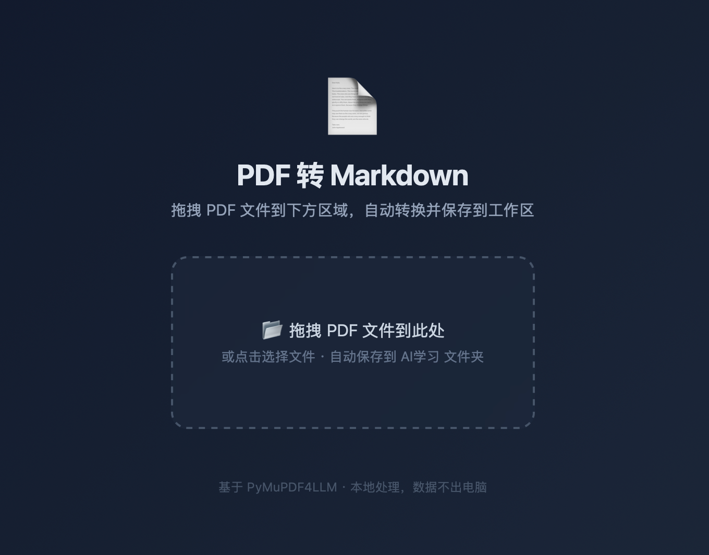

# 📄 PDF → Markdown 转换工具

[](https://www.python.org/)
[](LICENSE)
[](https://github.com/zhuzhu19881226/PDF2MD-tool)

基于 PyMuPDF4LLM 的本地 PDF 转 Markdown 工具，支持**网页版（拖拽转换）**和**终端版**双模式。完全本地处理，数据不出电脑。

---

## 运行截图

> 👇 将你的工具运行截图放到 `screenshots/` 目录下，命名为 `screenshot.png`，下面的占位图会自动替换。



---

## 功能特性

- 📄 **一键转换** — PDF 转 Markdown，完整保留标题、段落、列表等文档结构
- 🌐 **网页版** — 启动后在浏览器中拖拽 PDF 即可转换，体验友好
- ⌨️ **终端版** — 命令行交互，支持传参批量处理
- 🔧 **自动安装依赖** — 首次运行自动检测并安装 `pymupdf4llm`
- 🖥️ **Apple Silicon 原生支持** — M1/M2/M3/M4 芯片 + Intel 芯片均可运行
- 🔒 **完全本地处理** — 文件只在你的电脑上处理，不上传任何服务器

---

## 快速开始

### 方式一：网页版（推荐）

双击 `启动转换.command`，选择 **1** 即可启动网页版。浏览器会自动打开，拖入 PDF 完成转换。

或者在终端运行：

```bash
python3 ~/Desktop/AI学习/PDF转MD工具/网页转换.py
```

### 方式二：终端版

双击 `启动转换.command`，选择 **2**，然后拖入或输入 PDF 文件路径。

或在终端运行：

```bash
python3 ~/Desktop/AI学习/PDF转MD工具/pdf_to_md.py
```

### 方式三：命令行直接转换

```bash
python3 ~/Desktop/AI学习/PDF转MD工具/pdf_to_md.py /path/to/your.pdf
```

---

## 安装要求

| 依赖 | 最低版本 | 说明 |
|------|----------|------|
| Python | 3.9+ | 推荐 `brew install python3` |
| pymupdf4llm | 最新版 | 首次运行时自动安装，无需手动操作 |

> **注意**：如果 macOS 提示"未签名开发者"，请在 **系统设置 → 隐私与安全性** 中允许运行，或直接使用终端命令启动。

---

## 文件结构

```
PDF转MD工具/
├── 网页转换.py              # 🌐 网页版 — 浏览器拖拽转换
├── pdf_to_md.py             # ⌨️ 终端版 — 命令行交互/传参
├── 启动转换.command          # 🚀 启动入口 — 自动选择模式
├── README.md                # 📖 使用说明
├── .gitignore
└── screenshots/             # 🖼️ 截图目录
```

---

## 常见问题

<details>
<summary><strong>双击启动脚本没反应？</strong></summary>

macOS 25+ 加强了安全限制。请右键 `启动转换.command` → **打开方式 → 终端**，或直接在终端中运行对应 Python 脚本。
</details>

<details>
<summary><strong>提示找不到 Python？</strong></summary>

```bash
brew install python3
```
</details>

<details>
<summary><strong>端口被占用？</strong></summary>

网页版脚本会自动尝试 8765–8774 端口。如果全部被占用，可修改 `网页转换.py` 中的 `PORT` 变量。
</details>

<details>
<summary><strong>转换结果不完整或格式错乱？</strong></summary>

PyMuPDF4LLM 对扫描件、图片密集型 PDF 效果有限。复杂表格或图片文档建议使用 `/pdf-converter` skill（基于 MinerU）。
</details>

<details>
<summary><strong>输出文件在哪里？</strong></summary>

- **网页版**：保存到工作区根目录（`AI学习/`），同时触发浏览器下载
- **终端版**：保存到 `PDF转MD工具/output/`
</details>

---

## 技术原理

```
PDF 文件 → PyMuPDF4LLM 解析 → Markdown 文本 → 保存到本地
                  ↑
           网页版：HTTP 本地服务器 + 浏览器拖拽上传
           终端版：CLI 交互式转换
```
